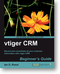

| vtiger CRM Beginner's Guide ||
| ------ ||
|Author: Ian D. Rossi Packt Publishing First published: July 2011 Pages: 249 ISBN 978-1-84951-186-5 [Book on Packt Publishing](http://www.packtpub.com/vtiger-crm-beginners-guide/book)||

A valuable contribution to the vtiger CRM project. While the general contents of the book is in line with the title, a few chapters seem out of place and a bit more depth in a few aspects is missing.

The first two chapters inform the reader about what the project is and how to get it running, both cover these topics thoroughly. The next two chapters take us on a quick tour of the basic functionality of vtiger CRM. With many screen shots, maybe too many screen shots and avoiding to comment on the many pitfalls that arise when using vtiger CRM. Chapters 5 to 7 are more focused on an administrator point of view and get into some of the configuration parts of the project. Again, too many screen shots and a total lack of comments on the glitches where many users get stuck, but it covers one of the hardest parts to understand and dominate in vtiger CRM which is the permission system. Along with chapter 9 and the appendix which are all very interesting, they complete a good overview of the project, this is where the book should have ended, at most a few pages commenting on the possibilities that vtlib and open source code, in general, give to the project.

In my opinion, the effort and pages of chapters 8 and 10 should have been invested in explaining in more detail the features of the program that are just skimmed over and much more user (beginner) oriented. Maybe because I spend a great part of my day reading the forum and answering questions that people ask once and again I find these points important and I think they should be covered in a book like this. While development of new modules and the more advanced possibilities do not need to be covered in a Beginner's Guide. Truth is that the preface states correctly that the intended audience are IT Professionals, Sales Consultants and CRM Project Managers to whom these two chapters may be enlightening but I think that most of the people that will buy the book based on the title will find these two chapters out of scope and would have preferred more in depth explanation of importing, reporting or general use.

As an example, when I finished reading chapter 10, my first thought was: "wow, this would probably be my second chapter if I wrote a book on vtiger CRM Development".

All in all the book is a very needed complement to the vtiger CRM project, more books about the program are needed to spread the word.

The general tone of the book is pleasant, as most Packt books I have read, the pop quiz keeps you thinking and the whole book covers the basic knowledge that is needed to start implementing the program in any company and then some.

Although the price is high (in my opinion most books are), it is still a recommended read and a good starting point for anybody who seriously wants to use vtiger CRM to solve their internal business organization needs or who wants to start using vtiger CRM to solve the business problems of their own clients.

Joe 
TSolucio